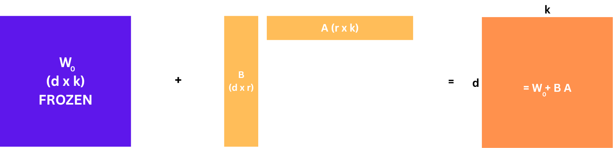

## 4. LoRA

For a targeted pretrained matrix $W_0 \in \mathbb{R}^{d \times k}$, LoRA represents the adaptation update as

$$
\Delta W \;=\; B A, \qquad B \in \mathbb{R}^{d \times r}, \;\; A \in \mathbb{R}^{r \times k}, \;\; r \ll \min(d, k).
$$

The effective weight used in the forward pass is $W = W_0 + \Delta W = W_0 + B A$. For an input $x$,

$$
h \;=\; W_0\, x \;+\; \frac{\alpha}{r}\, B A\, x .
$$

Four design choices from the paper are worth pausing on:

- **Initialization.** $A$ is initialized with a Gaussian, and $B$ is initialized to zero. At step 0, $\Delta W = B A = 0$, so the model starts exactly at the pretrained function — a safe starting point.
- **Scaling $\alpha / r$.** The update is multiplied by $\alpha/r$. This makes training roughly rank-agnostic: when we change $r$ we do not need to re-tune the learning rate. The paper sets $\alpha$ to the first $r$ they try and leaves it there.
- **Why small $r$?** The paper's hypothesis (supported empirically later in the paper) is that the task-specific update lives in a very low-dimensional subspace. The extreme result from the paper's Table 6 is that $r = 1$ or $r = 2$ is often enough for GPT-3 adaptation.
- **No extra parameters in the base path.** $W_0$ is frozen. No optimizer state is allocated for it, which is where the memory savings come from.

Below is a matrix-shape view of the factorization.




```python
print('Hello world')
```